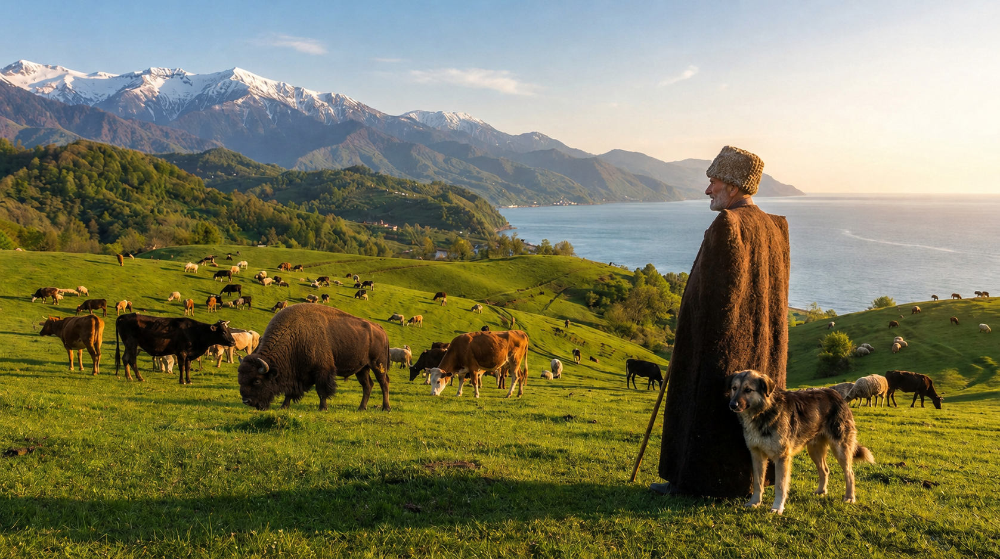
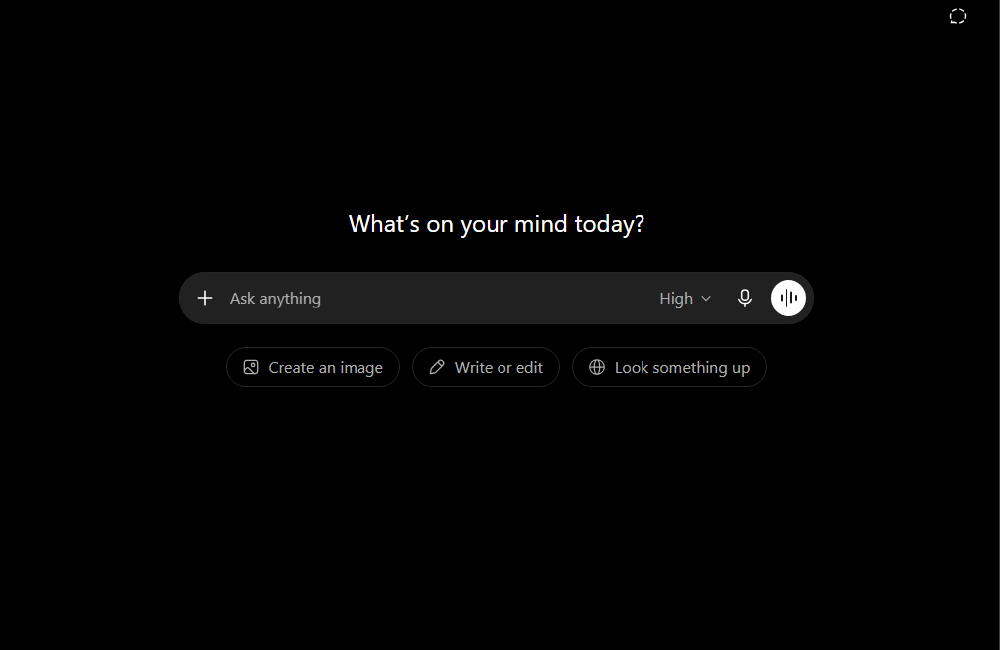
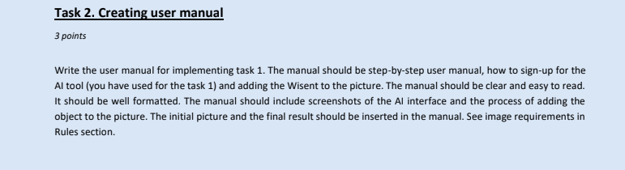
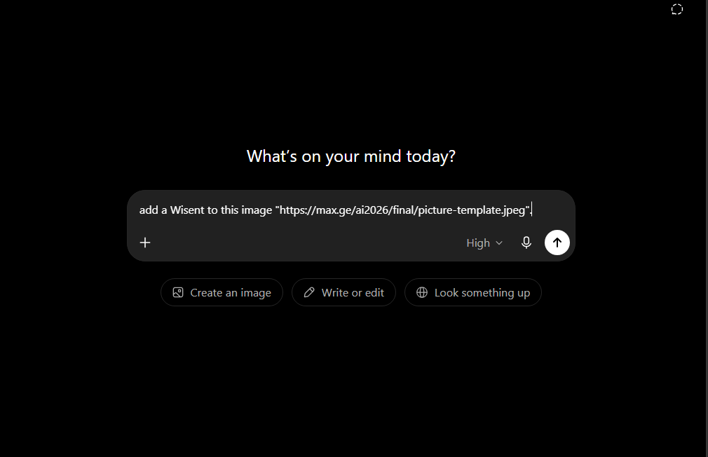
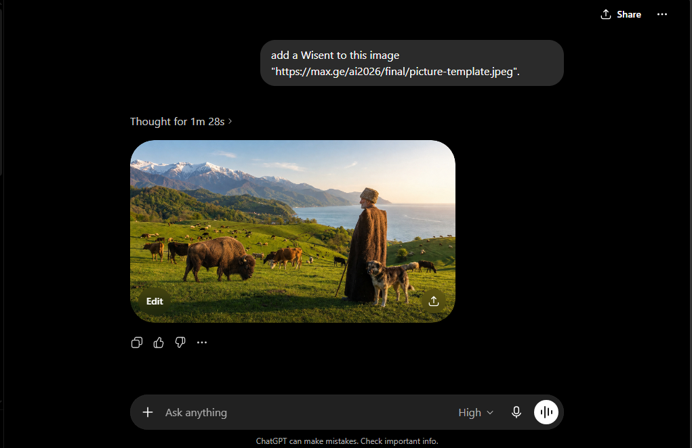

# Task 1




# Task 2: User Manual for Adding a Wisent Using ChatGPT

## Purpose of the Manual

This manual explains how to use ChatGPT as a generative AI tool to add a Wisent to the provided image from Task 1. The process includes opening the AI tool, uploading the original picture, writing a clear prompt, generating the edited image, and inserting the final result into the Markdown answer file.

---

## Required Files

The following files are used in this task:

| File Name               | Description                                      |
| ----------------------- | ------------------------------------------------ |
| `initial-picture.png`  | The original picture from the exam task          |
| `wisent.png`            | The final image with the Wisent added            |
| `chatgpt-interface.png` | Screenshot of the ChatGPT interface              |
| `chatgpt-upload.png`    | Screenshot showing the uploaded image and prompt |
| `chatgpt-result.png`    | Screenshot showing the generated result          |

---

## Step 1: Open ChatGPT

1. Open a web browser.
2. Go to ChatGPT.
3. Sign in to an existing account or create a new account.
4. After signing in, open a new chat.

The ChatGPT interface looks like this:



---

## Step 2: Download the Initial Picture

1. Open the image link provided in the exam task.
2. Save the original picture to the computer.
3. Rename the file to:

```text
initial-picture.png
```

The initial picture used for the task is shown below:



---

## Step 3: Upload the Picture to ChatGPT

1. In the ChatGPT chat box, click the upload or attachment button.
2. Choose the file:

```text
initial-picture.png
```

3. Wait until the image appears in the chat.

---

## Step 4: Write the Prompt

After uploading the image, write a clear instruction. The prompt used for this task was:

```text
Add one realistic Wisent, also known as a European bison, into this picture. Place it naturally on the grassy hillside among the other animals. Match the lighting, shadows, perspective, and style of the original image so that it looks realistic.
```

The uploaded image and prompt are shown below:



---

## Step 5: Generate the Edited Image

1. Submit the prompt.
2. Wait for ChatGPT to generate the edited picture.
3. Check that the Wisent appears naturally inside the scene.
4. Save the generated image as:

```text
Wisent.png
```

The result generated by ChatGPT is shown below:



---

## Step 6: Insert the Final Image into Markdown

To insert the final image into the Markdown file, the following Markdown syntax was used:

```markdown

```

The final result is shown below:


---

## Conclusion

ChatGPT was used as a generative AI tool to edit the original picture and add a Wisent. The process involved uploading the original image, giving a clear text instruction, generating the edited image, saving the result, and inserting it into the `answer.md` file using standard Markdown image syntax.
